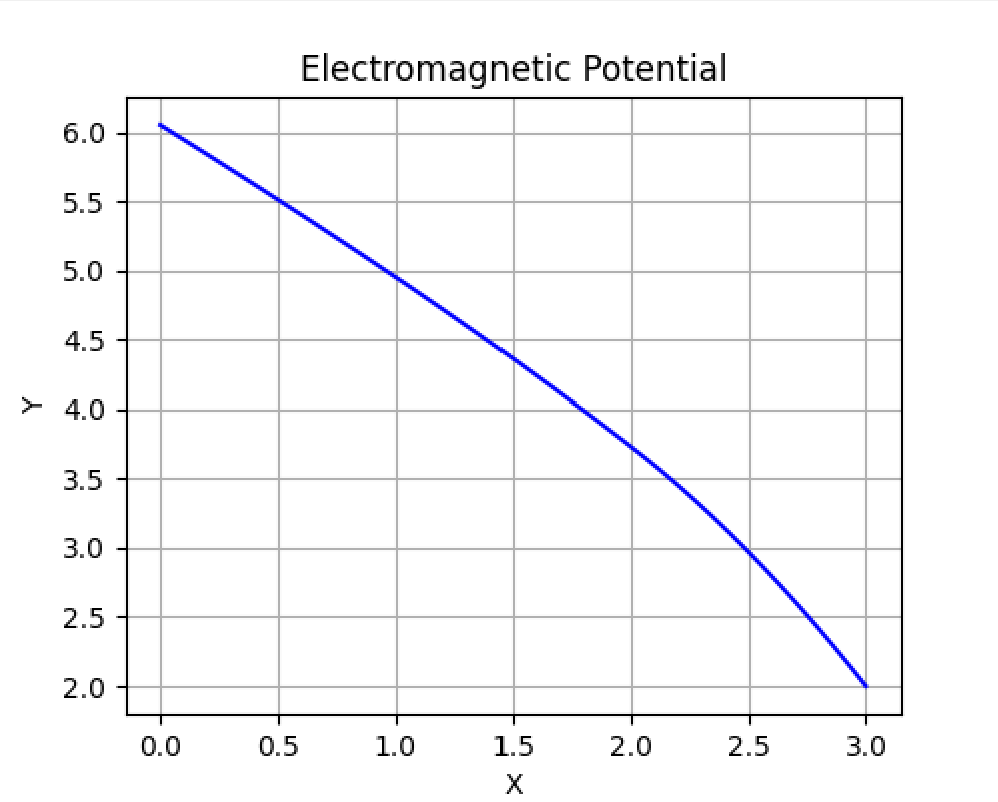
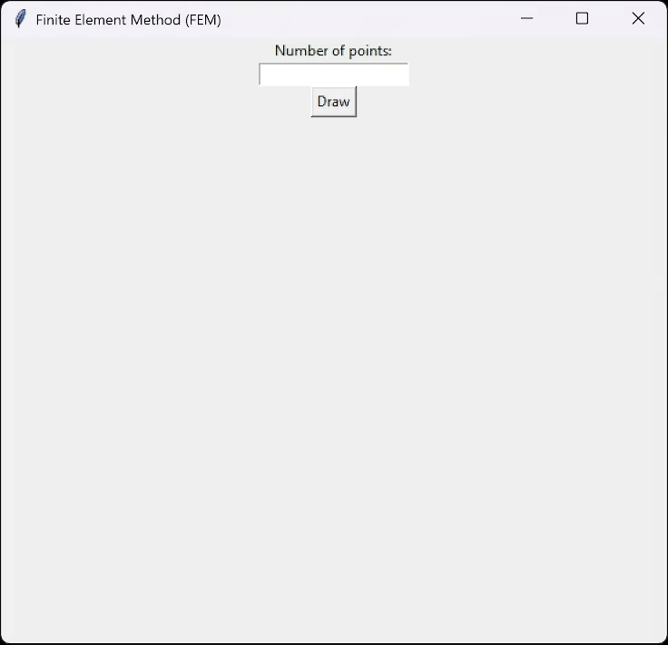

# Finite Element Method for Electromagnetic Potential

This repository provides a Python implementation of the Finite Element Method (FEM)
solver for the electromagnetic potential problem.
The project was developed for the Differential Equations course at
AGH University of Science and Technology in Kraków.



## Overview
- FEM_solver.py: Contains function for calculating the numerical solution of the FEM equation.
- main.py: Provides a graphical interface with Matplotlib and Tkinter for visualization of the FEM solution.
- [Wyprowadzenie_sformulowania_wariacyjnego].pdf: Variational formula calculations (in Polish).

## Installation
To install the necessary dependencies, run:

```
pip install -r requirements.txt
```

## Usage
Run:
```
python main.py
```
Then enter the desired amount of points to calculate and click **Draw** button.


